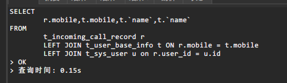
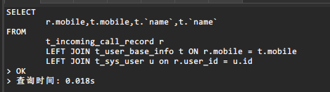

# 基本情况
## 测试环境  
    主表 35条数据 副表1 34000 副表2 34000
    查询 耗时 0.15s左右
简化后sql如下
```sql
SELECT
	r.mobile,t.mobile,t.`name`,u.`name`
FROM
	t_incoming_call_record r
	LEFT JOIN t_user_base_info t ON r.mobile = t.mobile
	LEFT JOIN t_sys_user u on r.user_id = u.id and u.is_delete = 0;
```
## 生产环境
    主表 600+ 数据 副表1 12w+ 副表2 12w+
    查询 耗时 30s左右

## 解决方式：
    不使用 left join  采用 N+1次查询 整个接口响应从超时优化到 0.1s

# 深层次原因
    两个关联字段字符集不一致
    utf8  和  utf8mb4 

修改字符集后数据库查询比较   

